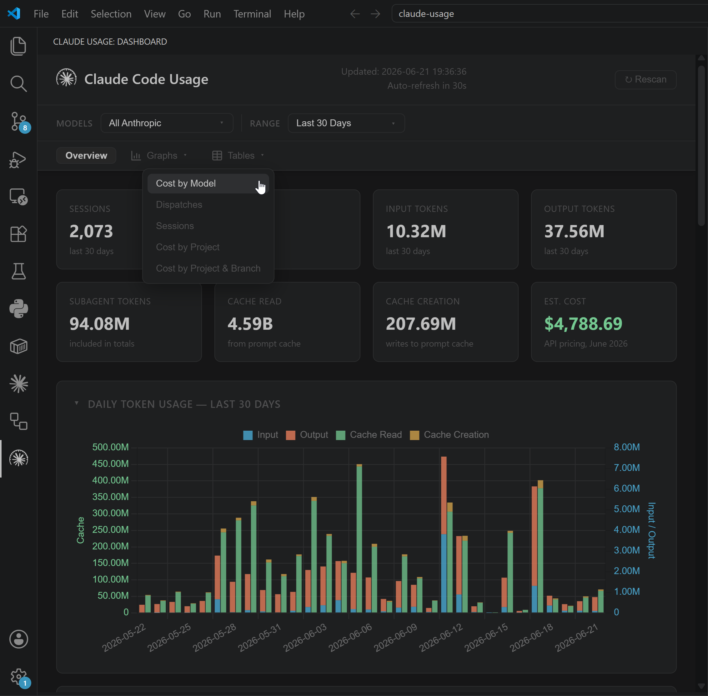
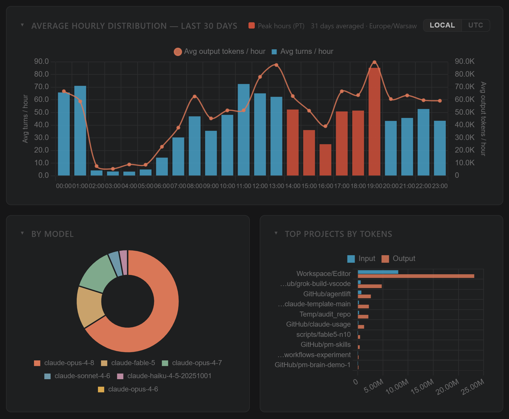
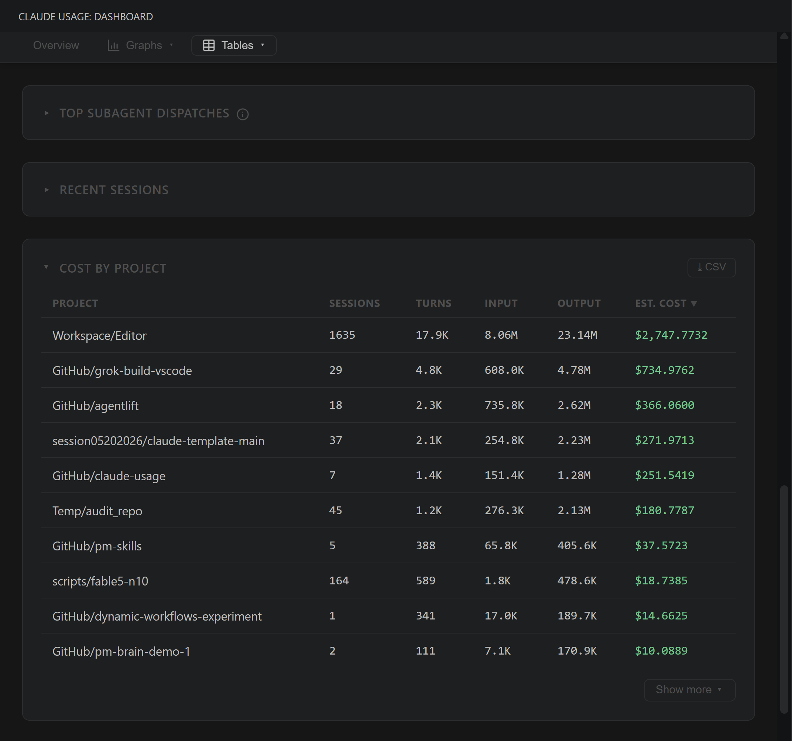

# Claude Code Usage Dashboard

[](LICENSE)
[](https://claude.ai/code)

**Pro and Max subscribers get a progress bar. This gives you the full picture.**

Claude Code writes detailed usage logs locally — token counts, models, sessions, projects — regardless of your plan. This dashboard reads those logs and turns them into charts and cost estimates. Works on API, Pro, and Max plans.



**Created by:** [The Product Compass Newsletter](https://www.productcompass.pm)

---

## What this tracks

Works on **API, Pro, and Max plans** — Claude Code writes local usage logs regardless of subscription type. This tool reads those logs and gives you visibility that Anthropic's UI doesn't provide.

Captures usage from:
- **Claude Code CLI** (`claude` command in terminal)
- **VS Code extension** (Claude Code sidebar)
- **Dispatched Code sessions** (sessions routed through Claude Code)

**Not captured:**
- **Cowork sessions** — these run server-side and do not write local JSONL transcripts

---

## Requirements

- Python 3.8+
- No third-party packages — uses only the standard library (`sqlite3`, `http.server`, `json`, `pathlib`)

> Anyone running Claude Code already has Python installed.

## Quick Start

No `pip install`, no virtual environment, no build step.

### macOS / Linux (Homebrew)
```
brew install --formula https://raw.githubusercontent.com/phuryn/claude-usage/main/Formula/claude-usage.rb
claude-usage dashboard
```

After install, the `claude-usage` command is on your `PATH` and accepts the same subcommands as `python cli.py` (`scan`, `today`, `stats`, `dashboard`).

### macOS / Linux (clone)
```
git clone https://github.com/phuryn/claude-usage
cd claude-usage
python3 cli.py dashboard
```

### Windows
```
git clone https://github.com/phuryn/claude-usage
cd claude-usage
python cli.py dashboard
```

### Docker
```
git clone https://github.com/phuryn/claude-usage
cd claude-usage
bash scripts/run-docker.sh
```

Opens the dashboard at **http://localhost:9898**.

The script builds the image, then runs the container with:
- `~/.claude` mounted **read-only** — the container can read your transcripts but cannot modify them
- A named Docker volume (`claude-usage-data`) for the SQLite database — persisted across restarts, isolated from your home directory

---

## Usage

> On macOS/Linux, use `python3` instead of `python` in all commands below. If you installed via Homebrew, replace `python cli.py` with `claude-usage`.

```
# Scan JSONL files and populate the database (~/.claude/usage.db)
python cli.py scan

# Show today's usage summary by model (in terminal)
python cli.py today

# Show the last 7 days (per-day breakdown + by-model totals)
python cli.py week

# Show all-time statistics (in terminal)
python cli.py stats

# Scan + open browser dashboard at http://localhost:8080
python cli.py dashboard

# Custom host and port via environment variables
HOST=0.0.0.0 PORT=9000 python cli.py dashboard

# Scan a custom projects directory
python cli.py scan --projects-dir /path/to/transcripts
```

The scanner is incremental — it tracks each file's path and modification time, so re-running `scan` is fast and only processes new or changed files.

By default, the scanner checks both `~/.claude/projects/` and the Xcode Claude integration directory (`~/Library/Developer/Xcode/CodingAssistant/ClaudeAgentConfig/projects/`), skipping any that don't exist. Use `--projects-dir` to scan a custom location instead.

---

## How it works

Claude Code writes one JSONL file per session to `~/.claude/projects/`. Each line is a JSON record; `assistant`-type records contain:
- `message.usage.input_tokens` — raw prompt tokens
- `message.usage.output_tokens` — generated tokens
- `message.usage.cache_creation_input_tokens` — tokens written to prompt cache
- `message.usage.cache_read_input_tokens` — tokens served from prompt cache
- `message.model` — the model used (e.g. `claude-sonnet-4-6`)

`scanner.py` parses those files and stores the data in a SQLite database at `~/.claude/usage.db`.

`dashboard.py` serves a single-page dashboard on `localhost:8080` with Chart.js charts (loaded from CDN). It auto-refreshes every 30 seconds and supports model filtering and a date-range dropdown with bookmarkable URLs. A sticky section nav jumps between sections, and every chart/table can be collapsed (remembered across reloads). The bind address and port can be overridden with `HOST` and `PORT` environment variables (defaults: `localhost`, `8080`).

---

## Cost estimates

Costs are calculated using **Anthropic API pricing as of June 2026** ([claude.com/pricing#api](https://claude.com/pricing#api)).

**Only models whose name contains `fable`, `mythos`, `opus`, `sonnet`, or `haiku` are included in cost calculations.** Local models, unknown models, and any other model names are excluded (shown as `n/a`).

| Model | Input | Output | Cache Write | Cache Read |
|-------|-------|--------|------------|-----------|
| claude-fable-5 | $10.00/MTok | $50.00/MTok | $12.50/MTok | $1.00/MTok |
| claude-mythos-5 | $10.00/MTok | $50.00/MTok | $12.50/MTok | $1.00/MTok |
| claude-opus-4-8 | $5.00/MTok | $25.00/MTok | $6.25/MTok | $0.50/MTok |
| claude-opus-4-7 | $5.00/MTok | $25.00/MTok | $6.25/MTok | $0.50/MTok |
| claude-opus-4-6 | $5.00/MTok | $25.00/MTok | $6.25/MTok | $0.50/MTok |
| claude-sonnet-4-6 | $3.00/MTok | $15.00/MTok | $3.75/MTok | $0.30/MTok |
| claude-haiku-4-5 | $1.00/MTok | $5.00/MTok | $1.25/MTok | $0.10/MTok |

> **Note:** These are API prices. If you use Claude Code via a Max or Pro subscription, your actual cost structure is different (subscription-based, not per-token).

---

## VS Code extension

If you'd rather see the dashboard inside your editor, the same UI is available as a VS Code extension. Same data, same charts, embedded as an activity-bar sidebar.

[**Install from the VS Code Marketplace →**](https://marketplace.visualstudio.com/items?itemName=PawelHuryn.claude-usage-phuryn)




The Python sources are bundled inside the `.vsix`, so the only end-user requirement is **Python 3.8+ on your `PATH`**. After install, click the gauge icon in the activity bar — the server spawns automatically and the dashboard renders in the sidebar.

See [vscode-extension/README.md](vscode-extension/README.md) for settings, commands, discovery order, and local-install instructions.

---

## Files

| File | Purpose |
|------|---------|
| `scanner.py` | Parses JSONL transcripts, writes to `~/.claude/usage.db` |
| `dashboard.py` | HTTP server + single-page HTML/JS dashboard |
| `cli.py` | `scan`, `today`, `stats`, `dashboard` commands |
| `Formula/claude-usage.rb` | Homebrew formula — install with `brew install --formula <raw-url>` |
| `vscode-extension/` | VS Code extension — embeds the dashboard inside VS Code |
| `Dockerfile` | Container image definition |
| `scripts/run-docker.sh` | Build and run the dashboard in Docker with a read-only `~/.claude` mount |
